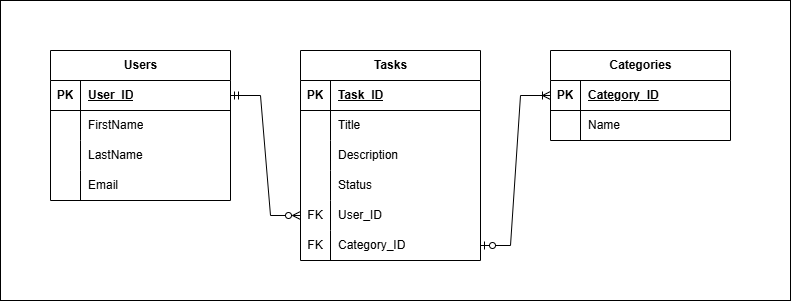

# SQLite Task Manager DB

## ⚙️ Database Structure

The project includes three tables:

1. Users: Stores user information.
2. Categories: Organizes tasks into categories.
3. Tasks: Stores task details, linked to both Users and Categories.

## 📊 Entity-Relationship Diagram (ERD)

Here's the database structure of the project:



## 🌟 Features

- Simple and modular CRUD operations.
- Safe SQL queries using parameterized placeholders (?).
- Clear separation of concerns for easier maintenance.
- Foreign key constraints for relational integrity.

## 📦 Requirements

- Python 3.8+
- SQLite3 (included with Python)

## 🚀 How to Run the Project

1. Clone the repository:

```bash
git clone https://github.com/your-username/sqlite-task-manager.git
cd sqlite-task-manager
```

2. Create Database:

```bash
python task_manager_db_creator.py
```

3. Perform CRUD Operations:

- Add a Task:

```bash
python add_data.py
```

- Fetch Tasks:

```bash
python fetch_data.py
```

- Update a Task:

```bash
python update_data.py
```

- Delete a Task:

```bash
python delete_data.py
```

Each file contains predefined outputs, which are used for ensuring the correctness and to display the results of operations done.

## 📜 License
This project is licensed under the MIT License. See the `LICENSE` file for details.
